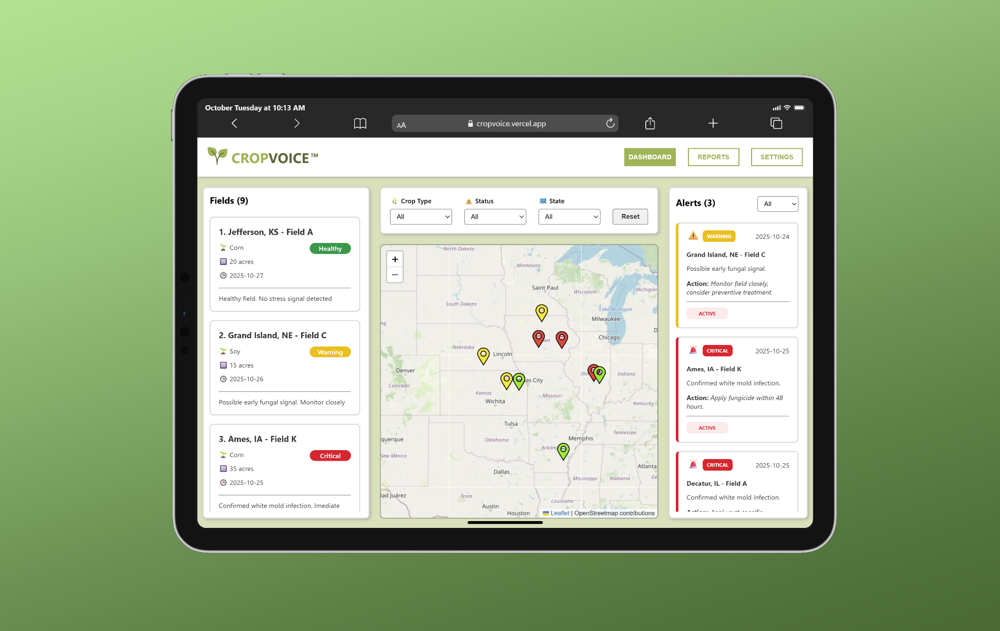

# 🌿 CropVoice Dashboard (Frontend Concept)

### *A mock UI prototype inspired by InnerPlant’s CropVoice system, where plants communicate their health directly to farmers.*




## 📖 Overview

**CropVoice Dashboard** is a conceptual frontend I built to explore how InnerPlant’s breakthrough technology could be visualized at scale.  
It’s designed as a **responsive, map-based interface** that displays real-time crop health data, helping farmers and agronomists make faster, data-driven decisions.

This project is not affiliated with InnerPlant. It’s a personal prototype built to demonstrate:
- **Understanding of CropVoice’s product goals and data flow**
- **Frontend architecture design** for data visualization at scale
- **Passion for sustainable agriculture and human-centered UI**


## 🌱 Background

InnerPlant engineers crops that emit optical fluorescent signals when under stress from disease, pests, or environmental factors.  
Their flagship product, **CropVoice**, aggregates those plant signals captured by sensors or satellites, and turns them into actionable alerts for farmers.

This dashboard re-imagines how that data could look in a web app:
- Fields visualized on an interactive **Leaflet.js** map  
- Color-coded health alerts by infection level  
- Detailed field panel for actionable insights  
- A clean, intuitive interface to easily manage data


## 🧭 Features

| Feature | Description |
|----------|-------------|
| 🗺️ **Interactive Map** | Displays all fields with color-coded markers or polygons representing infection severity (Healthy, Warning, Critical). |
| ⚠️ **Real Time Alerts** | Right Sidebar lists recent infections detected. |
| 📋 **Field Panel** | Left Sidebar lists current fields providing quick insights. |
| 🔍 **Filters & Search** | Filter by region, crop type, infection severity. |


## 🧩 Tech Stack

- **Framework:** React (Vite)  
- **Styling:** CSS  
- **Map Visualization:** Leaflet.js  
- **Mock Data:** Object-based dataset simulating CropVoice data  
- **Deployment:** Vercel  

---

## 🧠 Data Model (Example)

```
{
    id: 1,
    name: "Jefferson, KS - Field A",
    location_city: "Jefferson",
    location_state: "Kansas",
    coordinates: { lat: 39.2828, lng: -95.3103 },
    crop: "Corn",
    acreage: 20,
    signalType: "Healthy",
    signalColor: "Green",
    notes: "Healthy field. No stress signal detected",
    lastScan: '2025-10-27',
    fieldBoundaries: [
        { lat: 39.4, lng: -95.5 },
        { lat: 39.4, lng: -95.1 },
        { lat: 39.0, lng: -95.1 },
        { lat: 39.0, lng: -95.5 }
    ]

}
```

## 🎨 Design Principles

- **Data → Insight:** Present complex biological signals in a clear, visual form.  
- **User-Friendly:** Clean, easy-to-navigate interface with intuitive interactions.  
- **Scalable:** Modular components to support multiple regions or crop types.
- **Color Theme:** Shades of green inspired by agriculture and plant vitality.  


## 🚀 Future Enhancements

- Add **user authentication** and roles (Farmer/Agronomist/Admin).  
- Integrate **real weather APIs** and live map tiles.  
- Build backend **mock API** for realistic data flow.  


## 🧑‍💻 About the Developer

**Minh Luc** - Frontend Engineer & UC San Diego Data Science graduate.  
Passionate about combining **visual design, data visualization, and sustainability** to build meaningful tools.

- 🌎 [minhluc.com](https://minhluc.com)  
- 💻 [github.com/mluc404](https://github.com/mluc404)  
- ✉️ mluc.connect@gmail.com  


## 📜 License

This project is for **educational and demonstration purposes only** and is **not affiliated with or endorsed by InnerPlant, Inc.**